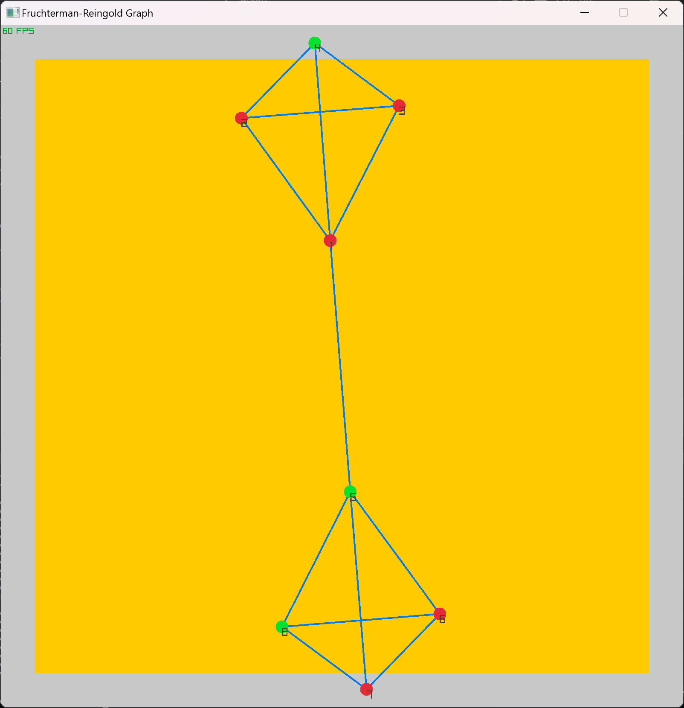

# **Graph drawing: the *Fruchterman-Reingold* algorithm**

Started on 16/07/2024.

Excerpt from :
https://ar5iv.labs.arxiv.org/html/1201.3011

> *"Force-directed algorithms are among the most flexible methods for calculating layouts of simple undirected graphs.* 
>
> *Also known as spring embedders, such algorithms calculate the layout of a graph using only information contained within the structure of the graph itself, rather than relying on domain-specific knowledge.* 
>
> *Graphs drawn with these algorithms tend to be aesthetically pleasing, exhibit symmetries, and tend to produce crossing-free layouts for planar graphs."*


This code implemenents the  **Fruchterman-Reingold** variant Algorithm.


> *This algorithm computes attractive forces between adjacent vertices and repulsive forces between all pairs of vertices.* 
>
> *The algorithm of Fruchterman and Reingold adds the notion of “temperature” which could be used as follows:
>
> “the temperature could start at an initial value (say one tenth the width of the frame) and decay to 0 in an inverse linear fashion.”* 
>
> *The temperature controls the displacement of vertices so that as the layout becomes better, the adjustments become smaller.*

This RUST implementation is based on a Python code on Github:

https://github.com/IkerCanut/Fruchterman-Reingold

This project uses Raylib for Rust.
Raylib version: 3.7.0

Rust version: cargo 1.77.2 (e52e36006 2024-03-26).

Tested on Windows only.

To run it:

```rust 
cargo run .\grafos\2xk4.txt
```

### **References:**
THOMAS M. J. FRUCHTERMAN, EDWARD M. REINGOLD. Graph Drawing by Force–Directed Placement, Department of Computer Science, University of Illinois at Urbana-Champaign, 1304 W. Springfield Avenue, Urbana, IL 61801-2987, U.S.A.